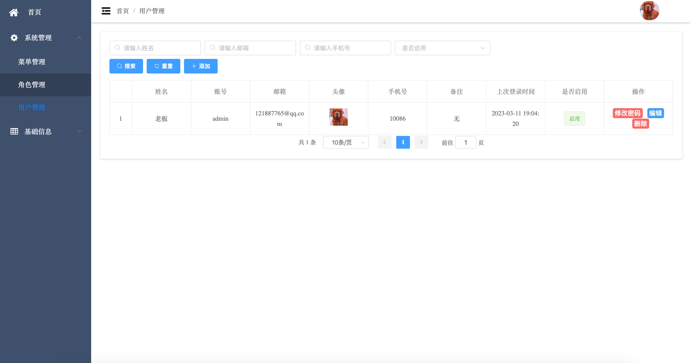
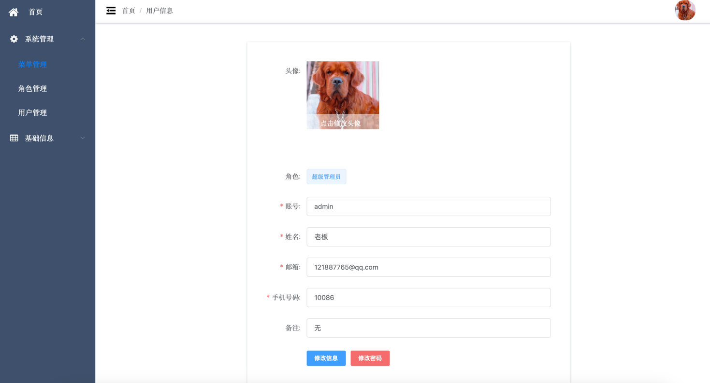

_# ecy管理系统

## 介绍
极简的管理系统，配有自动生成, 用户管理 ,角色管理 ,菜单管理 ,数据字典等功能

## 技术栈
springboot3，vue2+vuex+vue-router，mysql8，redis，邮件验证码

## 目录结构
├─ecy-common    公共类  
├─ecy-generator 代码生成模块  
├─ecy-system    系统模块  
├─ecy-server    主模块  
├─ecy-ui        vue项目

## 安装教程
ecy-server 中的`Application.java`为main启动类

1. 导入`sql`
2. 配置 yml的数据库信息
3. 登录qq邮箱，找到设置-账户-帐户安全，开启`SMTP服务`，记下密钥，写入yml邮箱配置


## 接口文档  
[http://localhost:8081/doc.html](https://localhost:8081/doc.html)

## 发布新版本，统一版本号
```shell
#执行会将所有模块pom中的版本号替换成新版本
mvn versions:set -DnewVersion=新版本号
```

## 示例图片


