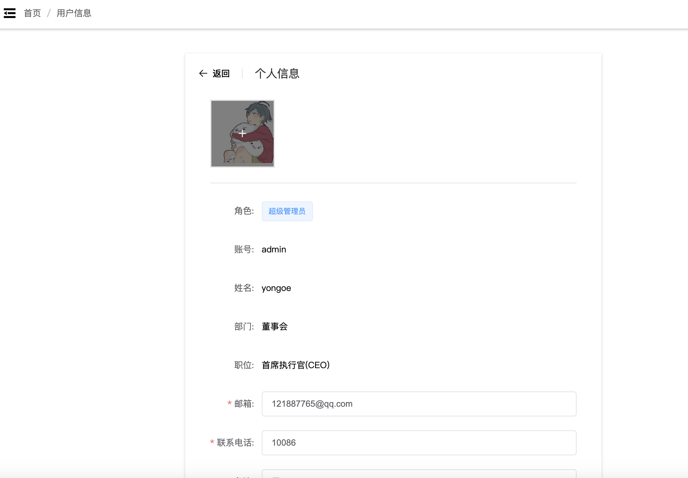

ecy管理系统

## 介绍
代码和功能都极简的管理系统，配有自动生成器，用户管理 ，角色管理，菜单管理，系统日志，数据字典，部门，职位，站内信等功能

## 技术栈
* 部署可选：dockerfile，docker-compose，nginx   
* 框架：springboot3，vue2+vuex+vue-router，mysql8，redis  
* 技术：mybatis-plus，lombok，mapstruct，jwt，easypoi  
* 接口文档：knife4j-openapi3
* 使用mapstruct，对reqVo-resVo-entity等进行互转  

## 目录结构
├─ecy-common    公共工具类  
├─ecy-generator 代码生成模块  
├─ecy-system    系统模块  
├─ecy-server    启动模块，新业务模块放在这里  
├─ecy-ui        vue2项目


## 安装教程
ecy-server 中的`Application.java`为main启动类
#### 后端
1. 导入`/sql/ecy-mysql8.sql`
2. 配置 yml 的mysql，redis 的ip、密码。默认选择`application-dev.yml`
3. 直接启动，页面账号admin，密码111111
#### 前端
ecy-ui 中的`README.md`为前端文档
1. 安装`nodejs16`（15也可以，高版本没试过）
2. 配置npm镜像源`npm config set registry https://registry.npm.taobao.org`
3. 进入`/ecy-ui`目录，执行`npm install`，安装依赖
4. 执行`npm run serve`，启动vue项目

#### 文件上传下载目录
上传文件，用户头像等，存储在项目主目录下的`ecy-file`文件夹，可在`配置文件`中修改
#### 接口文档
[http://localhost:8081/ecy/doc.html](https://localhost:8081/ecy/doc.html)  
注：携带token的问题，找到文档管理-全局参数设置，然后输入Authorization，参数为登录接口返回的token，复制即可

## docker启动
执行 sudo ./run.sh，内部流程为：打包jar，制作jar镜像，制作nginx与vue镜像，启动docker-compose
*  本地需要jdk17，maven环境（mvnw可以下载），编译vue是在docker容器内，不需要任何环境，闭眼运行即可
*  nginx容器设置了对外暴露80，443端口，转发`/ecy`开头的请求到后端的8081端口
*  docker-compose中，`host.docker.internal`为主机ip，相当于mysql，redis放到主机运行，并非容器
*  启动docker-compose，可修改nginx监听的域名，后端ip，在`/ecy-ui/nginx/default.conf`文件

## 额外功能

### qq登录(不需要就删掉登录页的按钮)
前置条件：需要备案过的域名，会用到备案号，可运行项目的服务器  
后端功能，是独立接口的代码文件，与系统无耦合
1. 在`QQ互联`申请， [参考教程](https://jingyan.baidu.com/article/39810a23b39a2db637fda650.html)
2. 申请得到`APP_ID`，`APP_KEY`，`CALLBACK`，在运行的系统中，系统配置页面设置这几个参数（其他方法，直接改表：mysql的sys_config）
3. 然后在服务器先把网页显示出来，实现点击登录页qq的图标，跳转到qq登录页面，这样才能审核通过
4. 等腾讯审核通过，就能登陆成功了

### 发送短信 & 发送验证码
1. 腾讯云：需要备案过的域名，会用到备案号
2. 购买短信服务，新人有免费额度，几块钱。[参考教程](https://blog.csdn.net/weixin_45193791/article/details/125279744)
3. 将获取到的参数等写进配置。在运行的系统中，系统配置页面设置这几个参数，或者改表的值`sys_config表`  
#### 示例代码
```java
@SpringBootTest
public class ConfigTest {
    @Resource
    private SmsUtils smsUtils;
    
    @Test
    public void sms() throws TencentCloudSDKException {
        // 发送验证码
        String code = smsUtils.sendVerificationCode("手机号");
        // 发送自定义短信
        smsUtils.sendSms(phone,content);
    }
}
```
### 发送邮件
1. 将邮箱，授权码等写进配置（比如去qq邮箱的设置中配置）。在运行的系统中，系统配置页面设置这几个参数，或者改表的值`sys_config表`
#### 示例代码
```java
@SpringBootTest
public class ConfigTest {
    @Resource
    private MailUtils mailUtils;
    @Test
    public void mail() throws Exception {
        mailUtils.sendMail("121887765@qq.com", "标题", "hello", false);
    }
}
```
## 示例图片


