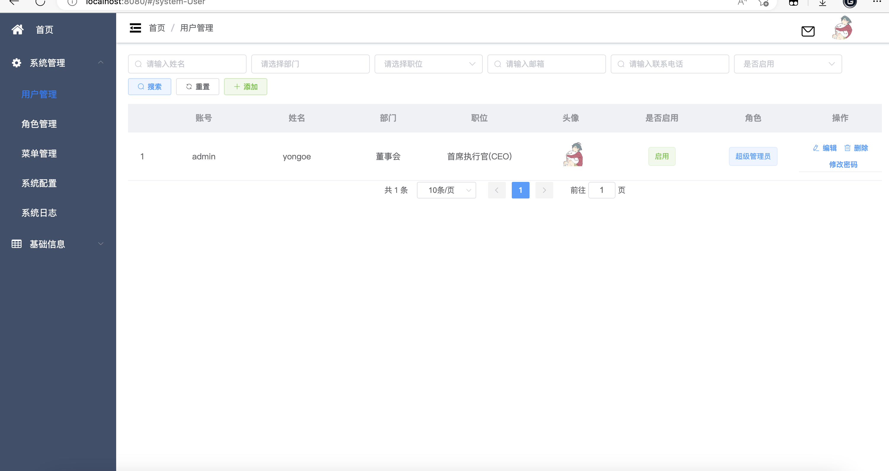

_# ecy管理系统

## 介绍
极简的管理系统，配有自动生成，用户管理 ，角色管理，菜单管理，数据字典，部门，职位等功能

## 技术栈
* dockerfile，docker-compose，nginx   
* springboot3，vue2+vuex+vue-router，mysql8，redis  
* mybatis-plus，knife4j-openapi3，lombok，mapstruct，jwt，easypoi  
* 使用mapstruct，对reqVo-resVo-entity等进行互转  

## 目录结构
├─ecy-common    公共类  
├─ecy-generator 代码生成模块  
├─ecy-system    系统模块  
├─ecy-server    主启动模块  
├─ecy-ui        vue项目


## 安装教程
ecy-server 中的`Application.java`为main启动类

1. 导入`sql`
2. 配置 yml的mysql，redis信息，redis
3. 直接启动，账号admin，密码111111

## docker启动
执行 sudo ./run.sh，内部流程为：打包jar，制作jar镜像，制作nginx与vue镜像，启动compose
*  主机需要jdk17，maven环境（不强制，mvnw可以下载），编译vue是在docker容器内，不需要任何环境
*  nginx容器对外暴露80，443端口，转发`/ecy`开头的请求 到 后端容器的8081端口，转发为容器内网络，不需要暴露后端的端口
*  docker-compose中，host.docker.internal 为主机ip，相当于本地localhost ，mysql，redis我是放到主机运行，并非容器
*  若在服务器启动docker-compose，可修改nginx监听的域名，在`/ecy-ui/nginx/default.conf`文件中

### qq登录(不设置也行，仅需删掉登录页的按钮)
1. 在`QQ互联`申请， [参考教程](https://jingyan.baidu.com/article/39810a23b39a2db637fda650.html)
2. 申请得到`APP_ID`，`APP_KEY`，`CALLBACK`，在运行的系统中，系统配置页面设置这几个参数，或者mysql的sys_config表
3. 然后在服务器先把网页显示出来，实现点击登录页qq的图标，跳转到qq登录页面，此时登陆qq会报错，但这样才能审核通过
4. 等腾讯审核通过，就能登陆成功了

#### 文件
上传文件，用户头像等，存储在jar目录下，或者代码主目录下的`/ecy-file/`

## 接口文档  
[http://localhost:8081/doc.html](https://localhost:8081/doc.html)  
注：无法解决携带token的问题，springdoc3不允许全局携带请求头token

## 其他功能
发送短信 & 发送验证码
#### 短信
1. 腾讯云：需要备案过的域名，会用到备案号
2. 购买短信服务，新人有免费额度，几块钱。[参考教程](https://blog.csdn.net/weixin_45193791/article/details/125279744)
3. 将获取到的参数等写进配置。在运行的系统中，系统配置页面设置这几个参数，或者mysql的sys_config表
```java
@SpringBootTest
public class ConfigTest {
    @Resource
    private SmsUtils smsUtils;
    
    @Test
    public void sms() throws TencentCloudSDKException {
        String code = smsUtils.sendVerificationCode("手机号");
        smsUtils.sendSms(phone,content);
    }
}
```
```java
 /**
  * 发送短信
  *
  * @param phone   手机号
  * @param content 内容
  */
public void sendSms(String phone, String[] content) 
```

## 示例图片


